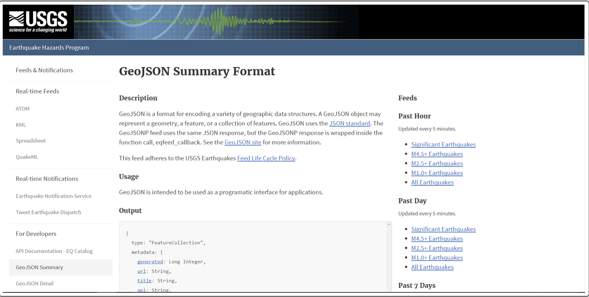
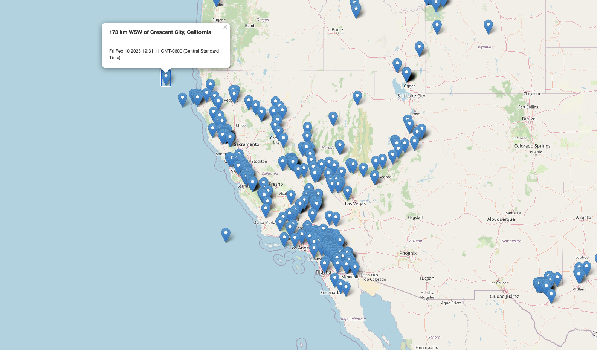

# Leaflet-Challenge / Module 15 Challenge
### Background
#### The United States Geological Survey, or USGS for short, is responsible for providing scientific data about natural hazards, the health of our ecosystems and environment, and the impacts of climate and land-use change. Their scientists develop new methods and tools to supply timely, relevant, and useful information about the Earth and its processes.
#### The USGS is interested in building a new set of tools that will allow them to visualize their earthquake data. They collect a massive amount of data from all over the world each day, but they lack a meaningful way of displaying it. This project is to develop a way to visualize USGS data that will allow them to better educate the public and other government organizations (and hopefully secure more funding) on issues facing our planet.
--- 
### The steps to create the Earthquake Visualization:
1. Get the dataset:
- The USGS provides earthquake data in a number of different formats, updated every 5 minutes. Visit [the USGS GeoJSON Feed Links](doc:https://earthquake.usgs.gov/earthquakes/feed/v1.0/geojson.php) to an external site. page and choose a dataset to visualize. 

2. Import and visualize the data by doing the following:
 - Using Leaflet, create a map that plots all the earthquakes from the dataset based on their longitude and latitude.
 - Include popups that provide additional information about the earthquake when its associated marker is clicked.
 - Create a legend that will provide context for your map data.
 
 ---
### References
Dataset created by [the United States Geological Survey](doc:https://earthquake.usgs.gov/earthquakes/feed/v1.0/geojson.php).